**Note:** This is a hackathon project and hence, was planned, designed and coded in 2 days, so one might find work-arounds in a few places, and is best viewed on desktops.

# Problem Statement

**Improving Access to Quality Healthcare Services through Digital Health Solutions**

The Sustainable Development Goals (SDGs) aim to ensure healthy lives and promote well-being for all at all ages. However, many communities still face challenges in accessing quality healthcare services due to various factors, such as geographical barriers, inadequate infrastructure, and lack of resources. This project aims to address these challenges by developing a comprehensive digital health solution that leverages emerging technologies to improve access to healthcare services and enhance the overall quality of care.

# Solution

**Healthcare Provider Dashboard**: A user-friendly dashboard for healthcare professionals, enabling them to efficiently track appointments, manage patient cases, and access comprehensive patient records. This component aims to streamline healthcare delivery processes, reducing administrative burdens and improving overall efficiency.

**Differential Diagnosis Assistant**: An integrated intelligent assistant that supports healthcare professionals in making accurate differential diagnoses based on patient complaints and symptoms. By leveraging advanced algorithms and medical knowledge bases, this assistant can provide valuable insights and recommendations, enhancing diagnostic accuracy and reducing the risk of misdiagnosis.

**Pharmacy Integration**: An NFC (Near-Field Communication) and mobile application-based system that allows patients to securely access their medical history and prescribed medications at pharmacy counters. This integration aims to improve medication adherence, reduce errors, and enhance patient safety.

**Patient Application**: A comprehensive dashboard that empowers patients to book appointments, access their medical reports, and receive diagnoses from previous appointments. This component promotes patient engagement, improves access to healthcare services, and fosters a collaborative approach to healthcare management.

**ABHA (Ayushman Bharat Health Account) Integration**: Integration with the government-initiated ABHA Number system, which serves as a secure and hassle-free method for accessing and sharing health records digitally. This integration ensures the interoperability of the proposed solution with existing healthcare infrastructure and promotes the adoption of digital health solutions.

# Using the project

**For doctors:** Goto [Login page](https://web-frontend-blush.vercel.app/).

**For patients:** Goto [Login page](https://web-frontend-blush.vercel.app/user).

**For guest login**: Click on the `guest login` button.

**Signin page**:
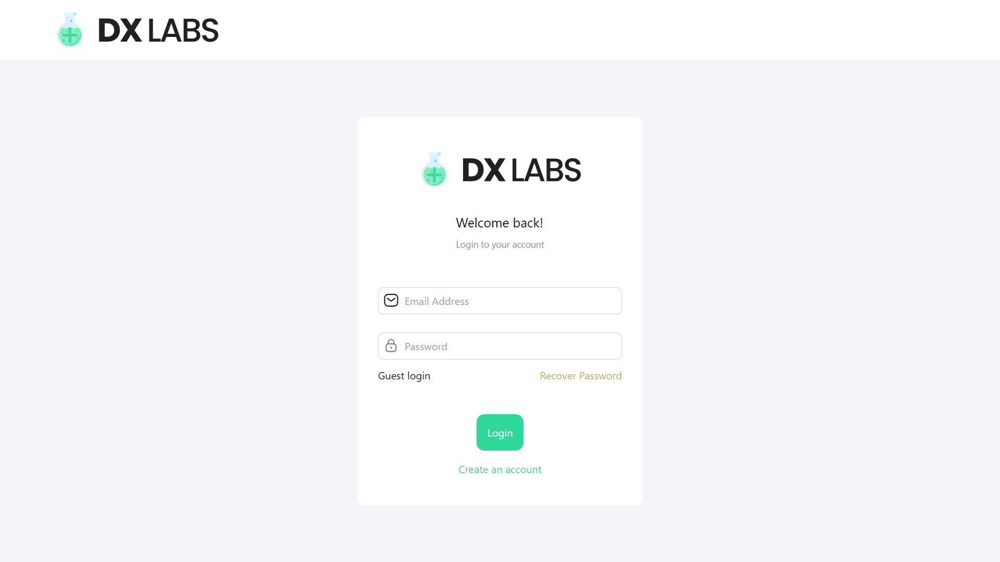

**Signup page**:
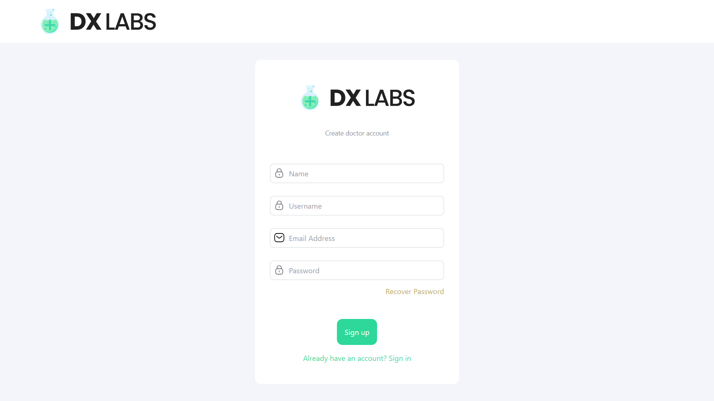

# Doctors

1. Create / Select a workspace.
2. You will then have access to the following tabs:
   - **Appointments**: View upcoming appointments and manage patient schedules.
   - **Patients**: Manage patient records, view medical history, and track patient progress.
   - **MedBot Assistant**: Access the intelligent assistant for differential diagnosis support.
   - **Settings**: Customize your dashboard settings and preferences.
   - **Create ABDM**: Create a new ABDM (Ayushman Bharat Digital Mission) record for patients.
   - **Create user card**: Create a new user card for patients.

**Workspaces**:

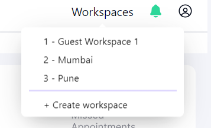

**Appointments Tab**:

- See all your appointments.
- Has a search bar to search for appointments.
- Click on the appointment to view more details.
- Inside an appointment:
  - Click `+ Create Diagnosis` to create a new diagnosis.

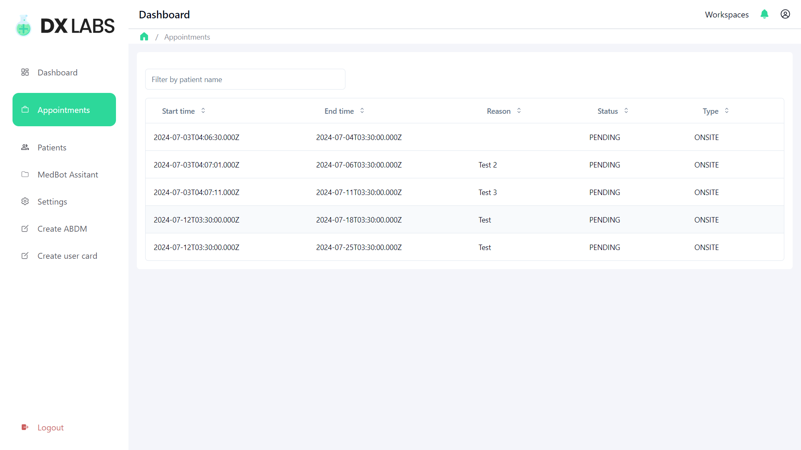

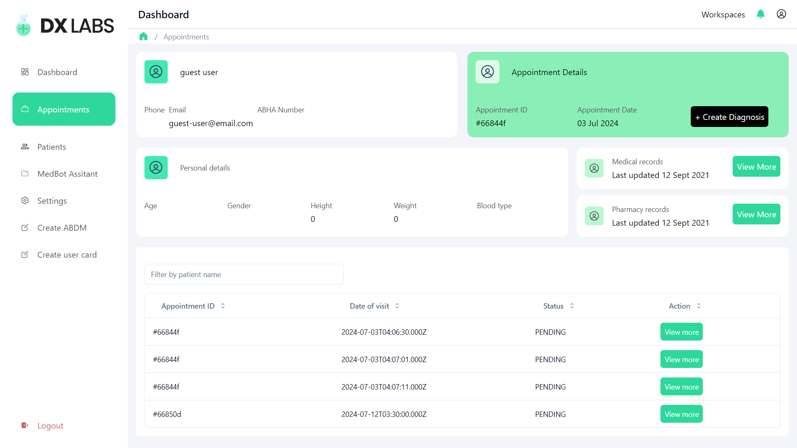

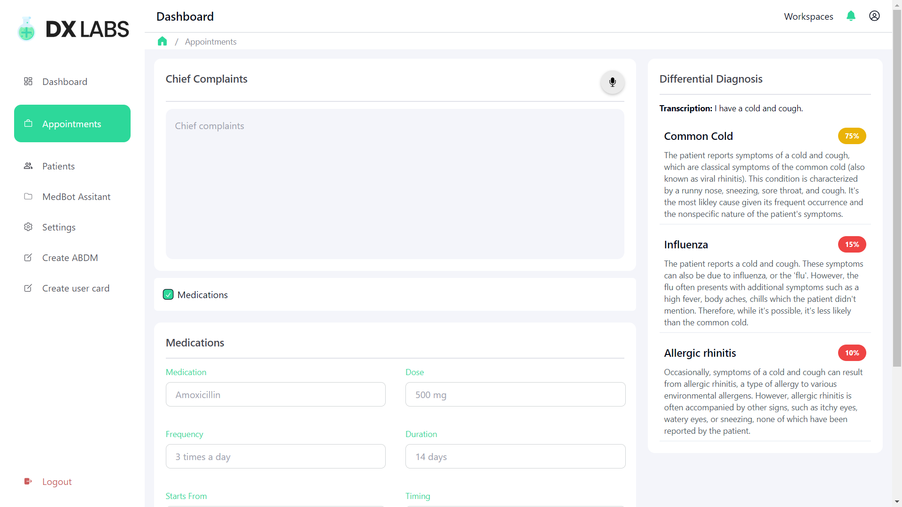

**Patients Tab**:

- See all your patients.
- Has a search bar to search for patients.

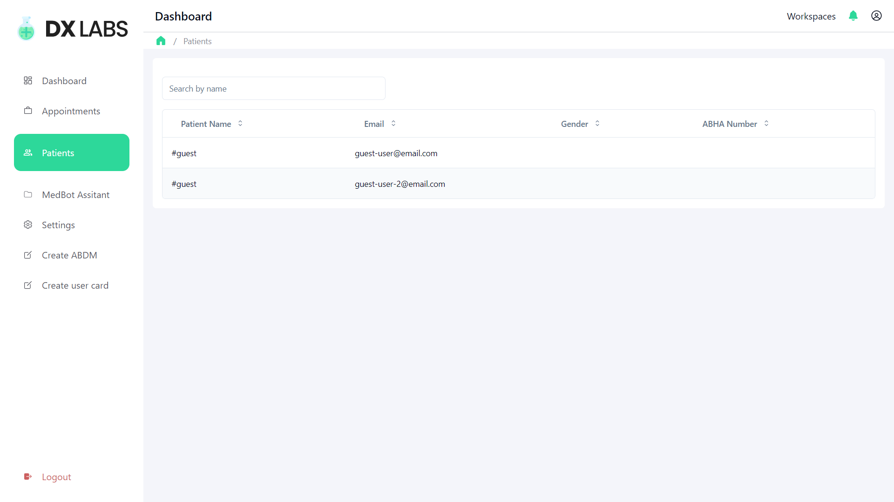

**MedBot Assistant Tab**:

- Use the MedBot Assistant to get differential diagnosis suggestions.
- Uses `Whisper AI API` to analyze multi-lingual audio conversations between the doctor and the patient.
- Also has a typing interface for the same.
- Provides response containing the solutions, follow up questions and resources that are relevant.

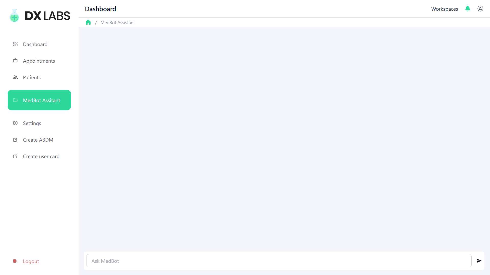
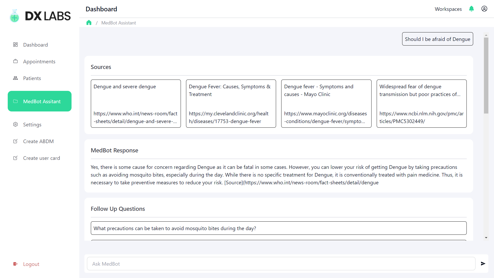
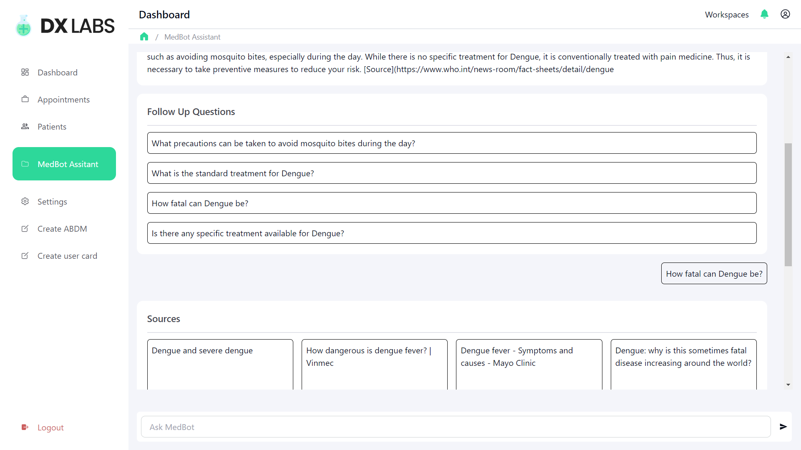

**Create ABDM**:

- Takes in the details of the patient and creates a new ABDM card for them.
- Uses multiple factors for authentication and verification such as the `Adhaar card number`, `phone number`, and `multiple OTPs`.

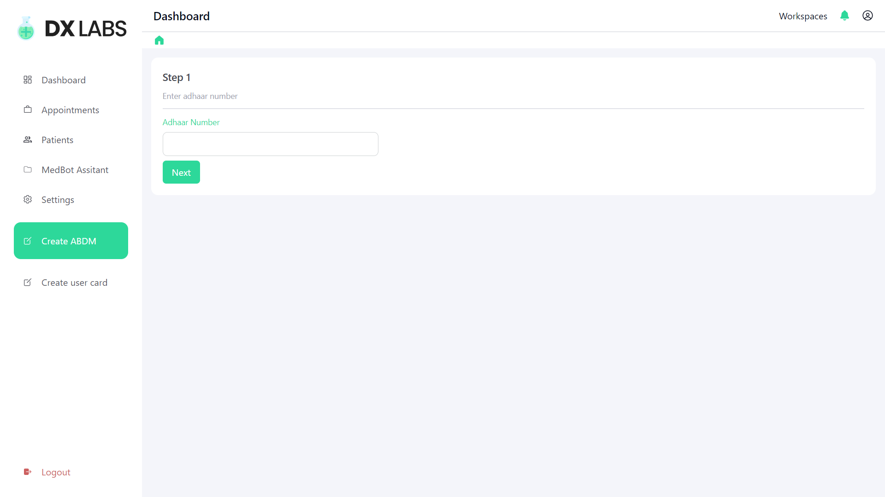

# Patients

A patient has access to 2 tabs:

- **Doctors**: View available doctors and book appointments.
- **Appointments**: View upcoming appointments and book new appointments.

**Doctors Tab**:

- Has a search bar to search for doctors.
- View all available doctors.
- Click on a `doctor row` or the `View More` button to view their profile.
- You will be shown all the workspaces that the particular doctor is a part of.
- Click on the `Book Appointment` button to book an appointment with the doctor.
- A modal opens up, choose the date and reason for the appointment.
- Click on the `Book Appointment` button to book the appointment.

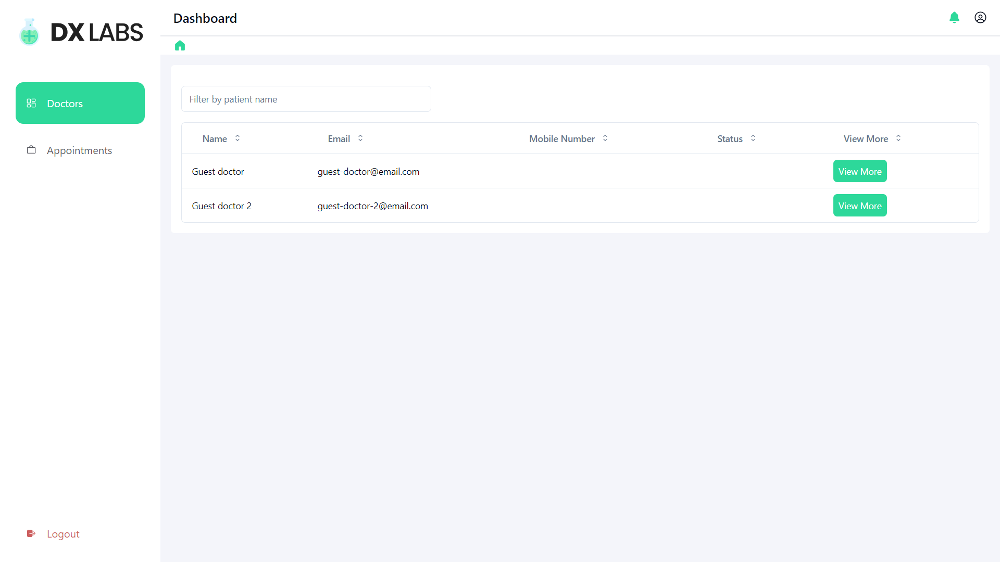

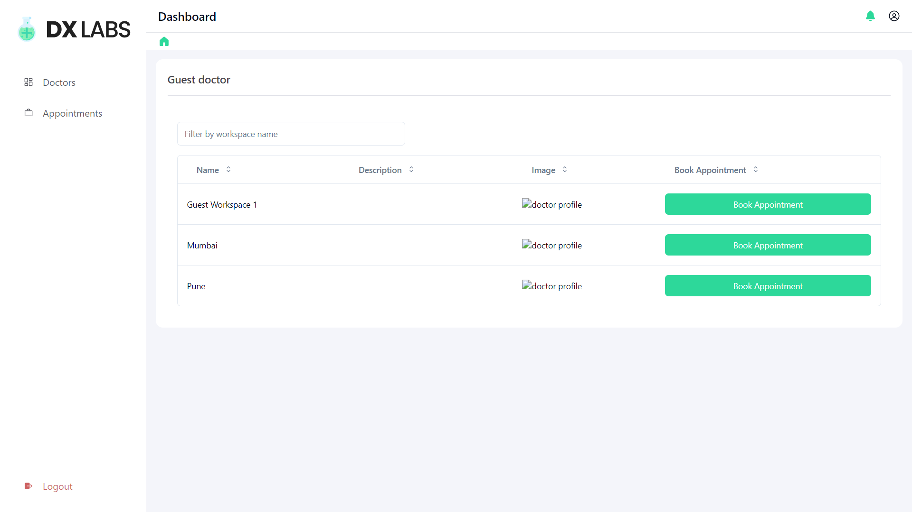

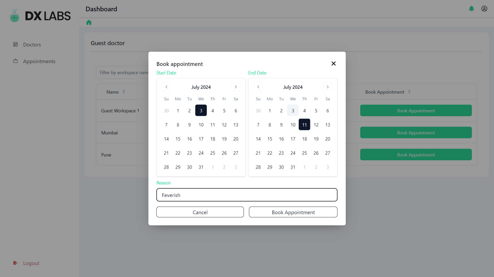

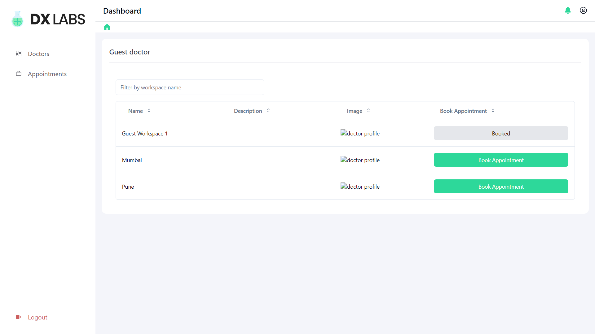

**Appointments Tab**:

- Has a search bar to search for appointments.
- Displays all the appointments and their status.

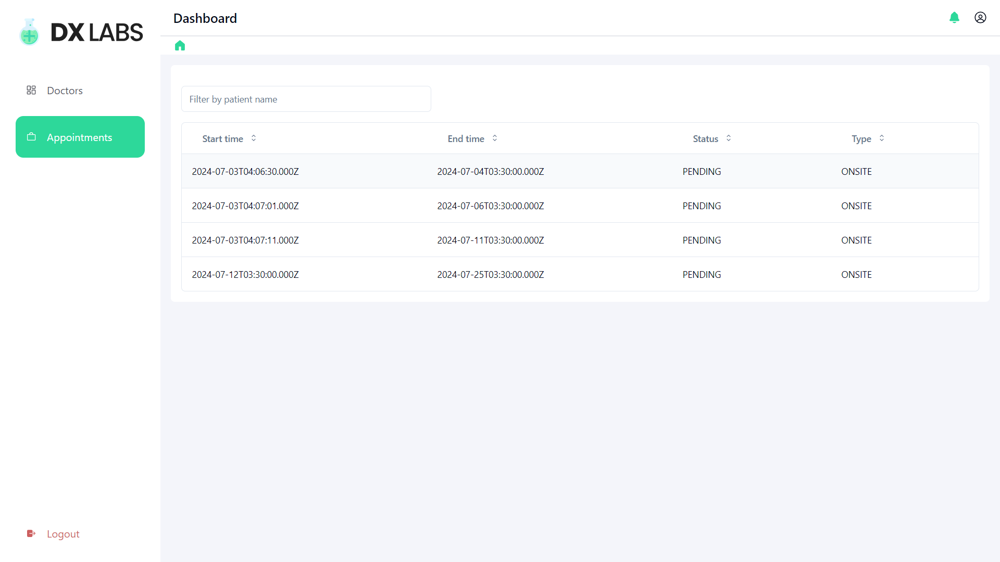
